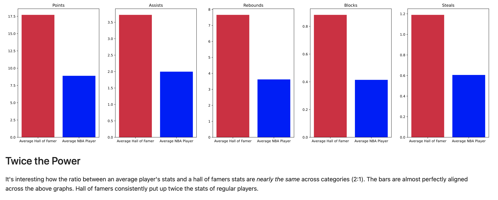
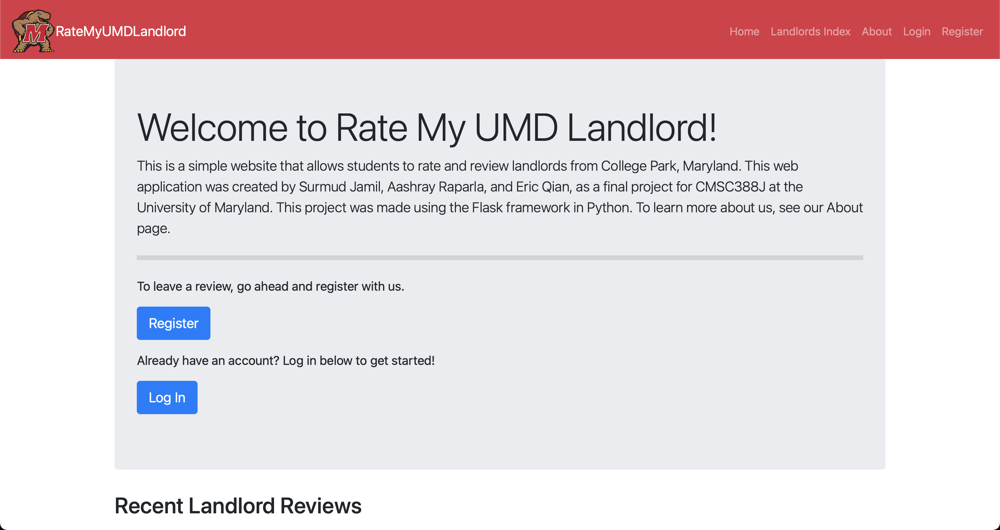
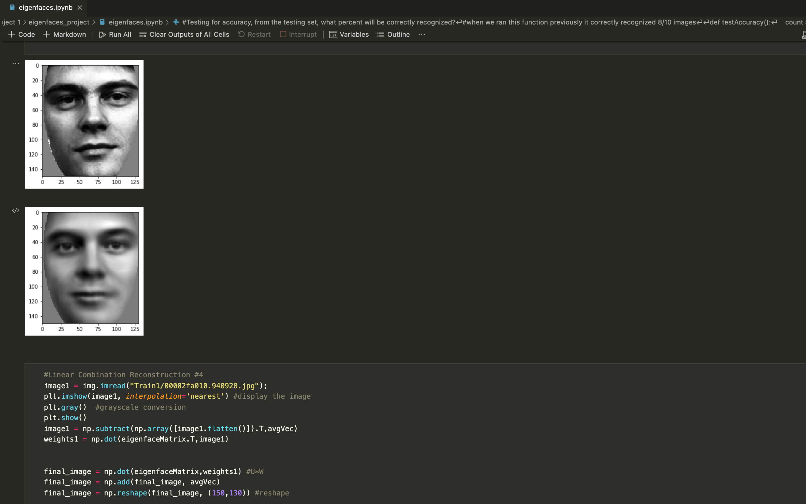

## About 
I'm Surmud Jamil and I am a senior year computer science undergrad at the University of Maryland. Some things I'm interested in are software engineering, data science, and machine learning. Since you're already stalking my github profile, you might as well take a look at some of my projects below and give me some feedback. If you'd like to reach out to me, you can always connect with me at www.linkedin.com/in/surmud

## Projects

### Jupiter: UMD Schedule Builder

Jupiter is a schedule builder for UMD students that intelligently generates and ranks potential schedules based on professor ratings and average GPA, while also removing duplicates, and ensuring that there are no time conflicts. Our application was developed specifically for a mobile device because it allows Apple Calendar synchronization, which means that the Jupiter will automatically sync a potential schedule with the user’s iPhone calendar. Once the user syncs a schedule, their calendar will have recurring meetings set up every single day for each course they selected at their proper time until the end of the semester.
- Check out the repository at https://github.com/surmud/jupiter

### NBA Hall of Fame Predictor
My friends and I used basketball statistics to predict NBA Hall of Famers with 85% accuracy. Are hall of famers more physical than today's players? Do today's players shoot more? We answer these questions in our jupyter notebook. To do this project, we needed to parse, scrape, and clean NBA basketball data from several different sources to be able to conduct our analysis. 
- Check out published notebook at https://surmud.github.io/NBA-Hall-of-fame-predictor/ 
- Check out the repository at https://github.com/surmud/NBA-Hall-of-fame-predictor

### Rate My UMD Landlord
Ever had a terrible landlord? This is your chance to vent. This is a web application that I was able to develop using the flask framework in python. It allows users to register, log in, and post reviews and ratings of their landlord. This application was deployed to the Heroku cloud platform as the final project of my python development class. We never really advertised this application, which is why there are only fake reviews posted on the site currently. In this project we needed to create both a front end and a backend for our flask application. Our application's data is stored in a MongoDB cloud database.

- Repository: https://github.com/surmud/rate-my-umd-landlord
- Web Application: https://ratemyumdlandlord.herokuapp.com

### Eigenface Recognition
In this project, my teammate and I implemented principal component analysis, which is a dimensionality reduction technique used in machine learning, to recognize images of faces with over 85% accuracy. We followed a case study based on an academic paper written by Turk and Pentland at https://www.face-rec.org/algorithms/PCA/jcn.pdf. This project was very math-heavy and required us to implement a lot of linear algebra in python, but we were able to gain a lot of valuable experience with the numpy library by doing this.

Note: This repository is private since it was a course project. Contact me if you'd like to see it. 
- https://github.com/surmud/Eigenface_Recognition

<!---
surmud/surmud is a ✨ special ✨ repository because its `README.md` (this file) appears on your GitHub profile.
You can click the Preview link to take a look at your changes.
--->
